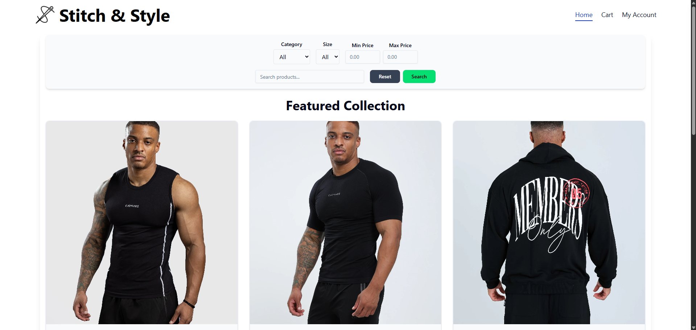
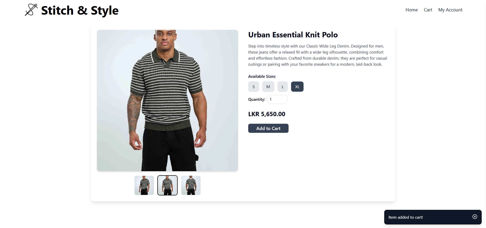
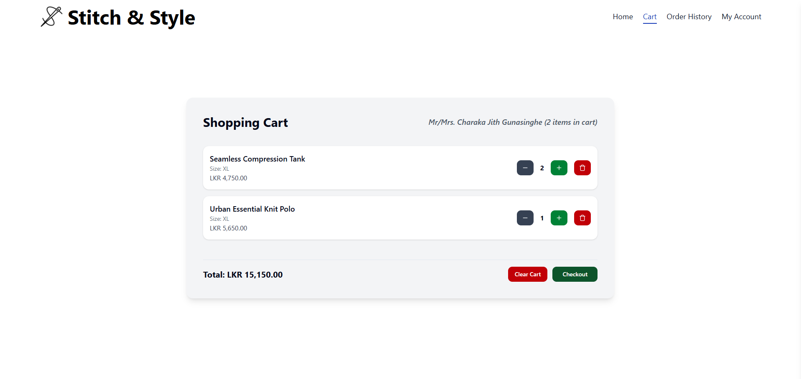
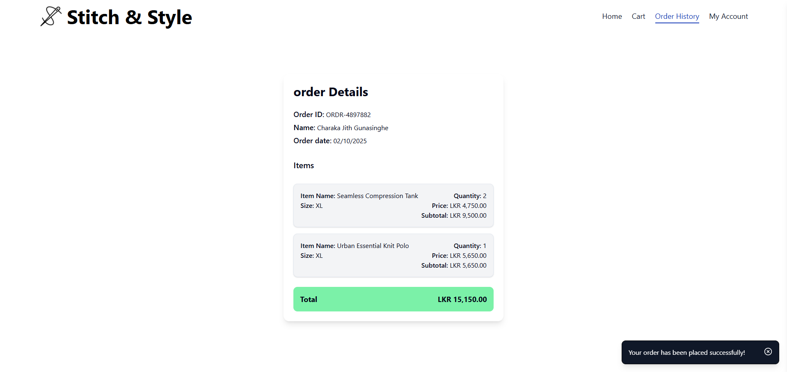
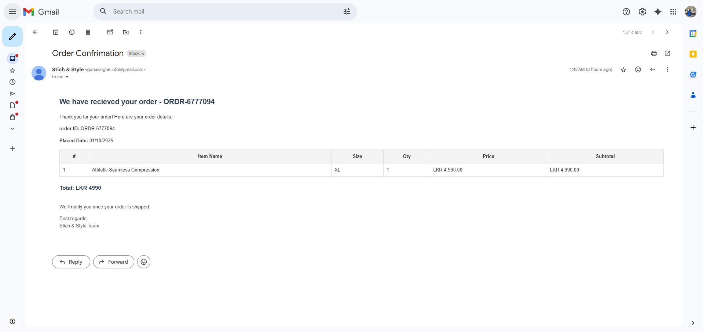

<div align="center">
  <h1="center">MERN Stack E-Commerce Website</h1>
</div>







### This project is a MERN stack e-commerce web application developed as part of the Aeontrix AI Backend Developer technical assessment. The application focuses on backend functionality and provides a robust and secure foundation for an online clothing store.

### Key features include secure user authentication and profile management, comprehensive user operations, product management with support for listing, search, filtering, and pagination, order management capturing items with selected sizes and quantities, and robust data validation with proper response codes and error handling. The backend is designed for scalability and maintainability, providing a solid foundation for a modern e-commerce platform.

### The application follows a modular and secure architecture with clear separation of concerns, leveraging the MERN stack for scalability and maintainability. It implements a RESTful API with proper authentication, product and order management, and robust data validation. The project also supports optional Docker containerization for easy deployment and provides a clean, structured codebase that demonstrates best practices in backend development.

### The project includes structured environment configuration for both development and production and is Docker-ready for easy deployment. Future improvements could include integrating payment gateways, implementing user roles, and enhancing frontend-backend interactions.

### Built with

- [![React][React.js]][React-url]
- [![Vite][Vite.js]][Vite-url]
- [![TailwindCss][TailwindCss]][Tailwind-url]
- [![Node][Node.js]][Node-url]
- [![Express][Express.js]][Express.js-url]
- [![MongoDB][MongoDB]][MongoDB-url]
- [![Mongoose][Mongoose]][Mongoose-url]
- [![Docker][Docker]][Docker-url]

## Getting started

### Prerequisites

- node.js: [Node.js download page](https://nodejs.org/en/download)
- React.js: [React official website](https://reactjs.org/)
- Vite: [Vite start guide](https://vite.dev/guide/)
- Tailwind CSS: [Tailwind getting stared](https://tailwindcss.com/docs/installation/using-vite)
- Mongo DB: [Mongo DB official website](https://www.mongodb.com/)
- Docker: [Docker download page](https://www.docker.com/products/docker-desktop/)

### Installation

1. Clone the repo
   ```bash
   git clone https://github.com/CharakaJith/mern-ecom-website.git
   ```
2. Step into the project
   ```bash
   cd mern-ecom-website
   ```

### Environment variables setup

#### Server side

1. Create a `.env` file in root folder
   ```
   New-Item -Path . -Name ".env" -ItemType "File"
   ```
2. Open the `.env` file and update the variables

   ```
   ## environment variables
   ENV=development
   PORT=8000 (make sure the port is set to 8000 if running the server with docker)

   ## mongo db
   MONGO_URI=mongodb+srv://<username>:<password>@<cluster-name>-cluster.2bsublg.mongodb.net/<database>

   ## jwt secrets
   ACCESS_TOKEN_SECRET=<secure random string>
   REFRESH_TOKEN_SECRET=<secure random string>

   ## nodemailer config (these fields are required to send emails via nodemailer)
   EMAIL_SERVICE=gmail
   EMAIL_USER=<gmail>
   EMAIL_PASS=<gmail pass key>

   ## test (optional)
   TEST_MAIL=<email to test nodemailer functionality>
   ```

#### Client side

1. Create a `.env` file in the client folder
   ```
   New-Item -Path . -Name ".env" -ItemType "File"
   ```
2. Open the `.env` file and update the variables

   ```
   ## base url
   VITE_API_BASE_URL=http://localhost:8000 (or the port you have used)

   ## contact details for footer
   VITE_CONTACT_EMAIL=<your email>
   VITE_CONTACT_PHONE=<your contact number>
   ```

#### Notes

- **For JWT secrets:** The <secure random string> values for `ACCESS_TOKEN_SECRET` and `REFRESH_TOKEN_SECRET` should be generated securely, for example using crypto.randomBytes in Node.js or a trusted online generator.
- **For server and client ports:** Ensure that the `PORT` in the server `.env` and `VITE_API_BASE_URL` in the client `.env` match, especially when running the application via Docker, to enable proper communication between frontend and backend.

### Start the project using Docker (recommended)

1. Build the docker image and run
   ```bash
   npm run docker:up
   ```
2. Stop running container
   ```bash
   npm run docker: down
   ```

### Start the project using terminal

1. Install NPM packages
   ```bash
   npm run install:all
   ```
2. Seed mock clothing items
   ```bash
   npm run seed
   ```
3. Start the server and client
   ```bash
   npm run start
   ```

### Other scripts

1. Start the development server
   ```bash
   npm run dev
   ```
2. Start the client
   ```bash
   npm run client
   ```

## Assumptions

The following assumptions were made during the development of this project:

### 1. Environment Configuration

- The application runs in a Node.js environment (version 20.18.1).
- Environment variables are provided in a `.env` file.
- The app uses `NODE_ENV=development` and `PORT=8000`.

### 2. Database

- **MongoDB** is used as the database for this project, providing a flexible, schema-less NoSQL solution suitable for e-commerce applications.
- The database contains three main collections: **User**, **ClothingItem**, and **Order**.
- **User Collection**
  - Stores user credentials, profile information, and authentication data.
  - Supports operations like registration, login, and profile updates.
- **ClothingItem Collection**
  - Stores product information including name, category, description, price, available sizes, and image URLs.
  - Supports search, filtering, and pagination.
  - Each item can be referenced in orders with selected size and quantity.
- **Order Collection**
  - Captures orders made by users, including references to the purchased clothing items, their sizes, quantities, and total price.
  - Stores order status, timestamps, and user association.
  - Designed to facilitate order management and backend reporting.
- **Mongoose** is used as the ORM to interact with MongoDB.
  - Provides schema definitions, model validation, and middleware support.
  - Simplifies CRUD operations and relationships between collections.
  - Supports population of references for relational-style queries (e.g; fetching user orders with item details).

### 3. Authentication & Security

- Passwords are hashed securely (e.g., using bcrypt) before being stored in the database.
- User authentication is handled using **JSON Web Tokens (JWT)**, which are issued upon successful login and validated on protected routes.
- Users cannot update other users' details and see order details that does not belong to them.

### 4. User Roles & Access

- Only authenticated users can access protected endpoints.
- No admin or multi-tier access roles are implemented.

### 5. Request & Response Handling

- Client requests are expected to be well-formed and follow the defined API contract.
- Errors are handled using appropriate HTTP status codes and clear response messages.

### 6. Logging

- The application uses **Winston** for logging, with log files rotating daily.
- Logs include details about HTTP requests, response status, and error messages.
- The log format includes timestamps, log levels, and structured JSON data.
- Error stack traces are logged only in development mode.
- Sensitive information is not logged.
- Logs are kept for **14 days** before being automatically deleted.

### 7. Error Handling

- The application uses a custom error handler to manage errors and send appropriate responses.
- Errors are logged using **Winston** with the log type depending on the error severity (`ERROR`, `FAIL`).
- The error handler responds with an appropriate HTTP status code and error message.
- In development mode, the full stack trace is included in the response for debugging purposes.
- Sensitive error details (like passwords or tokens) are not included in the logs or responses.

### 8. Architecture

- The application follows a layered architecture with the following structure:

  - **Client**: The front-end that interacts with the API.
  - **Route**: Defines the HTTP routes and endpoints exposed to the client.
  - **Controller**: Handles incoming requests and delegates business logic to services.
  - **Service**: Contains the core business logic and operations.
  - **Repository / Data access layer**: Provides an abstraction layer for interacting with the database.
  - **Database**: The mongo db database is used for storing and managing data.

## Identified Future Enhancements

- **Client-side**

  - **Wishlist & Favorites:** Allow users to save items for future purchase or create wishlists.
  - **Product Reviews & Ratings:** Enable users to leave reviews and ratings for purchased items.
  - **Improved Client-Side Validation:** Enhance form validations, error handling, and notifications.
  - **Dark/Light Mode:** Allow users to switch between themes dynamically.

- **Server-side**

  - **Payment Integration:** Implement real payment gateways (Stripe, Payhere) for seamless checkout and secure transactions.
  - **Inventory Management:** Track stock levels for clothing items, automatically updating availability and preventing overselling.
  - **User Roles & Permissions:** Introduce admin, vendor, and customer roles with granular access control.
  - **Unit Testing**: Implement automated testing using Jest or similar frameworks for robust backend verification.
  - **CI/CD Pipeline:** Set up continuous integration and deployment for automated testing, builds, and production deployment.
  - **Performance Optimization:** Improve API response times and database indexing for high traffic scenarios.
  - **Refresh token:** Implement a mechanism to refresh access tokens for users without requiring them to log in each time a sessionis expired.

### Declaration

- This project, including all source code and documentation, was developed by me as part of the Aeontrix AI Backend Developer technical assessment.
- Product descriptions and documentation were reviewed and refined using ChatGPT to ensure proper grammar, clarity, and professional English.
- All images used in this project are sourced from the Carnage and Nolimit websites, and the prices reflect those listed on these sites. The project is provided for educational and evaluation purposes only.
- ChatGPT was used as a guidance for UI component styling (CSS) and layout decisions. All backend functionality, including API implementation, database interactions, and business logic, as well as the thought process was independently concluded by the author.

## Documentations

- [Postman API documentation](https://documenter.getpostman.com/view/28014836/2sB3QFSD9D)
- [System architecture diagram](https://lucid.app/lucidchart/bd680031-4228-42f3-a2d0-46b5165bd647/edit?viewport_loc=-1286%2C-641%2C4178%2C1922%2C0_0&invitationId=inv_d3b50108-8771-4814-9e7c-9907878a5e91)
- [Implementation notes](./public/files/Implementation%20Notes.pdf)

## Contact

Email: [charaka.info@gmail.com](mailto:charaka.info@gmail.com) | LinkedIn: [Charaka Jith Gunasinghe](https://www.linkedin.com/in/charaka-gunasinghe/)

<!-- MARKDOWN LINKS & IMAGES -->

[React.js]: https://img.shields.io/badge/React-20232A?style=for-the-badge&logo=react&logoColor=61DAFB
[React-url]: https://reactjs.org/
[Vite.js]: https://img.shields.io/badge/Vite-646CFF?style=for-the-badge&logo=vite&logoColor=white
[Vite-url]: https://vite.dev
[TailwindCss]: https://img.shields.io/badge/Tailwind_CSS-06B6D4?style=for-the-badge&logo=tailwind-css&logoColor=white
[Tailwind-url]: https://tailwindcss.com/
[Node.js]: https://img.shields.io/badge/Node.js-12A952?style=for-the-badge&logo=node.js&logoColor=white
[Node-url]: https://nodejs.org/en
[Express.js]: https://img.shields.io/badge/Express.js-000000?style=for-the-badge&logo=express&logoColor=white
[Express.js-url]: https://expressjs.com/
[MongoDB]: https://img.shields.io/badge/MongoDB-47A248?style=for-the-badge&logo=mongodb&logoColor=white
[MongoDB-url]: https://www.mongodb.com/
[Mongoose]: https://img.shields.io/badge/Mongoose-880000?style=for-the-badge&logo=mongodb&logoColor=white
[Mongoose-url]: https://mongoosejs.com/
[Docker]: https://img.shields.io/badge/Docker-2496ED?style=for-the-badge&logo=docker&logoColor=white
[Docker-url]: https://www.docker.com/
